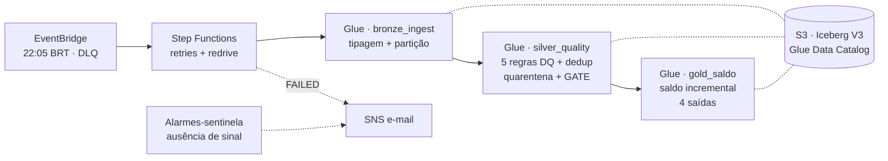

# Pipeline de Saldo por Contrato

Pipeline batch de contabilidade regulatória: cálculo diário do **saldo consolidado
por contrato e por conta**, com **classificação COSIF** e **reconciliação
débito × crédito por agência** — Apache Spark (PySpark) + Apache **Iceberg V3**,
arquitetura Medallion com **quarentena com motivos** (nunca descarte silencioso) e
**gate de qualidade** bloqueando o fechamento.

Duas trilhas de execução, mesmo código:

| Trilha | Para quê | Como |
|---|---|---|
| **Local (Docker)** | demo de ponta a ponta, offline, 1 comando | `make demo` |
| **AWS (Terraform)** | Glue + Step Functions + Data Catalog na conta real, com custo medido | [`docs/runbook_aws.md`](docs/runbook_aws.md) |

## Arquitetura



- `saldo(D) = snapshot(D−1) + movimento(D)` — incremental, nunca full scan do
  histórico; idempotente por INSERT OVERWRITE dinâmico da partição.
- Silver publica **silver + quarentena (com motivos) + relatório DQ** e o gate
  bloqueia o Gold se a qualidade do lote estiver abaixo do mínimo.
- Detalhes, leitura do SLA e dimensionamento para ~300M transações/dia:
  [`docs/arquitetura.md`](docs/arquitetura.md). Decisões com alternativas
  rejeitadas: [`docs/adr/`](docs/adr/).

## Trilha local (Docker) — demo em um comando

Pré-requisito: Docker.

```bash
make demo    # build + bronze → silver (gate) → gold para os 3 dias + relatório
make test    # suíte pytest completa (inclui o oráculo sobre o dataset real)
make lint    # ruff
```

O `make demo` termina imprimindo o relatório de qualidade por partição, amostras
das 4 saídas Gold e a prova de que **cada tabela está em Iceberg
`format-version=3`**. Reexecutar a demo é idempotente. O warehouse local fica em
`warehouse/` (`make limpar` remove).

Sem Docker (venv): `pip install -r requirements-dev.txt`, Java 17, jar do Iceberg
(`make baixar-jars`; exporte `ICEBERG_JAR=jars/iceberg-spark-runtime-3.5_2.12-1.10.2.jar`
e inclua-o via `PYSPARK_SUBMIT_ARGS="--jars $ICEBERG_JAR pyspark-shell"`), depois
`bash scripts/demo.sh`.

## Trilha AWS (Terraform)

Toda a arquitetura é provisionada por IaC — S3 com lifecycle 5y hot/10y cold,
Glue Data Catalog e 3 jobs, Step Functions, EventBridge Scheduler com DLQ, SNS,
alarmes-sentinela, IAM de menor privilégio e budget de US$ 10. Passo a passo,
**estimativa de custo antes de cada execução** e checklist de evidências:
[`docs/runbook_aws.md`](docs/runbook_aws.md).

```bash
cd terraform && terraform init && terraform apply
make aws-publicar-artefatos BUCKET=$(terraform -chdir=terraform output -raw bucket)
```

## Estrutura

```
src/jobs/       bronze_ingest.py · silver_quality.py · gold_saldo.py  (PySpark puro, sem GlueContext)
src/lib/        schema (contrato) · dq (5 regras) · dedup · saldo · session (catálogo) · log (JSON)
tests/          unitários por regra · e2e · oráculo independente em Python puro
terraform/      arquitetura AWS completa
docker/         imagem pinada: Spark 3.5.4 + Java 17 + Iceberg 1.10.2 (paridade Glue 5.0)
docs/           arquitetura + runbook AWS + 13 ADRs
dados/          dataset do caso (CSV) + referencial COSIF
```

## Qualidade e correção

- As **5 regras do contrato** geram quarentena com `motivos[]`; a política de
  unicidade é determinística e definida sobre **o que entra no razão**
  ([ADR-006](docs/adr/ADR-006-unicidade-sobre-o-publicado.md)).
- Correção provada por **dupla implementação**: um oráculo independente em Python
  puro (sem Spark) recalcula contagens e saldos e os testes exigem igualdade
  exata com o pipeline, contrato a contrato.
- CI (GitHub Actions): lint + suíte completa + `terraform validate` a cada push.
