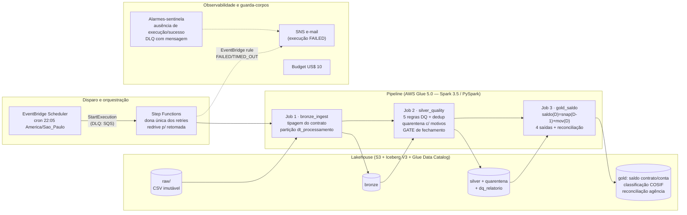

# Arquitetura da Solução

## Visão geral



**Trilha local (plano A da demo):** os mesmos 3 jobs em Docker (Spark 3.5.4 +
Java 17 + Iceberg 1.10.2 — paridade pinada com o Glue 5.0), catálogo Iceberg
HadoopCatalog em filesystem no lugar do Glue Data Catalog (ADR-012), `make demo`
executa tudo em um comando, sem nenhuma chamada AWS.

## Camadas

| Camada | Tabela | Conteúdo | Partição |
|---|---|---|---|
| raw | `s3://…/raw/` | arquivo como chegou (forense) | — |
| bronze | `bronze.fin_contabilidade_saldo_contrato` | tipado pelo contrato, sem filtro | `dt_processamento` |
| ref | `ref.cosif_dominio` | referencial COSIF | — |
| silver | `silver.fin_contabilidade_saldo_contrato` | válido + dedup + `valor_assinado` | `dt_processamento` |
| silver | `silver.quarentena` | violações com `motivos[]` — nunca descarte | `dt_processamento` |
| silver | `silver.dq_relatorio` | métricas de qualidade por partição | `dt_processamento` |
| gold | `saldo_contrato_diario` | snapshot completo diário (carry-forward) | `dt_referencia` |
| gold | `saldo_conta_diario` | agregação por conta | `dt_referencia` |
| gold | `classificacao_cosif` | tipo_contrato × cod_cosif × natureza | `dt_referencia` |
| gold | `reconciliacao_agencia` | débitos vs. créditos por agência | `dt_referencia` |

Por que `dt_processamento` como partição (P1.4): é a chave do LOTE — unidade de
chegada, de reprocessamento e de idempotência (INSERT OVERWRITE dinâmico da
partição). `dt_lancamento` descreve o fato, mas chega fora de ordem (3.257
registros com lançamento posterior ao processamento provam isso) — particionar
por ela quebraria a correspondência lote↔partição que sustenta o replay.

## Leitura do SLA (P5.1)

O enunciado traz "< 1 hora" e uma janela 22h→02h (4h) — lidas como camadas de um
mesmo requisito de resiliência:

```
22:00  dado pronto        (D+0)
22:05  disparo agendado
23:05  execução 1 DEVE ter acabado (SLA < 1h por execução)
      ├── sobra p/ ~2 retentativas/reprocessamentos dentro da janela
02:00  fim da janela de processamento
06:00  fechamento contábil (contingência de 4h para incidente grave)
```

O SLA de 1h dimensiona o cluster; a janela dimensiona o plano de falha (retries
da Step Function + redrive); as 4h finais são contingência operacional (P4.3).

## Escala de produção: ~300M transações/dia, ~80M contas (P3.1 / P3.5)

Volumetria estimada: 300M linhas × ~200 B ≈ **60 GB/dia** de entrada (Parquet
particionado, conforme o contrato); shuffle dominante no dedup (janela por
`id_transacao`) e nos joins do Gold.

**Dimensionamento proposto (ponto de partida a medir):**

| Parâmetro | Valor | Racional |
|---|---|---|
| Worker type | `G.2X` (2 DPU: 8 vCPU, 32 GB) | shuffle pesado se beneficia de mais memória/worker (menos spill) |
| Workers | 20 (= 40 DPU, 160 vCPU) | 300M linhas ÷ 160 cores ≈ 1,9M linhas/core; a 20–50 mil linhas/s/core, cada estágio shuffle fica em 1–2 min de CPU; com 3–4 estágios + I/O S3 → **15–25 min de parede por job crítico** — dentro do SLA de 1h com folga ≥ 2× |
| Auto scaling | habilitado, máx. 20 | bronze precisa de menos que silver/gold; paga-se pelo usado |
| Timeout | 55 min/job | menor que o SLA — falha rápida em vez de estourar a janela em silêncio |
| Retries | 0 no Glue; 2 na SFN c/ backoff+jitter | ADR-002 |
| `spark.sql.shuffle.partitions` | ~512 (2–3× cores) | AQE coalesce ajusta para baixo quando sobra |

**Custo estimado nessa configuração:** 3 jobs × ~20 min × 40 DPU × US$ 0,44/DPU-h
≈ **US$ 18/dia** (~US$ 530/mês) — número de partida para conversa de FinOps
(auto scaling e ajuste fino derrubam isso; medido > estimado, sempre).

**Onde cada otimização pedida atua (P3.2–P3.4):**
- **Broadcast join**: domínio COSIF (8 linhas) é broadcast explícito na validação
  e na classificação — o lado de 300M nunca embaralha por causa do referencial.
  Quando atrapalha: broadcast de tabela grande (o snapshot D-1 com 300M contratos
  JAMAIS — estouraria driver/executors); e broadcast dentro de loop de dias
  reenvia a tabela a cada iteração.
- **Skew (contas concentradas)**: AQE `skewJoin` habilitado divide partições
  gordas automaticamente. O dedup por `id_transacao` (UUID) é uniforme por
  natureza. O ponto sensível é a agregação por conta — se uma conta-mãe
  concentrar milhões de lançamentos, o plano B é salting (agregação parcial por
  `conta+salt` antes da final) — documentado, não aplicado preventivamente.
- **Cache/persist**: o Silver validado do dia alimenta 4 agregações Gold + o
  controle de consistência — `persist()` evita 4 releituras; custo = memória
  (spill para disco se faltar). No Silver, o resultado das regras (janela + 2
  joins) alimenta 3 escritas — mesmo racional.

## Retenção e manutenção do lakehouse

- **5 anos hot / 10 anos cold**, com um cuidado que separa raw de warehouse:
  - `raw/` (arquivos imutáveis, nunca referenciados por metadado vivo): lifecycle
    S3 por idade é seguro — Standard → Glacier em 1.825 dias, expiração em 5.475
    (Terraform, `s3.tf`).
  - `warehouse/` (Iceberg): lifecycle por **idade do objeto é uma armadilha** — um
    data file antigo continua referenciado pelo metadado ATUAL da tabela;
    transicioná-lo para Glacier quebra a leitura (`InvalidObjectState`) e
    expirá-lo corrompe a tabela. A retenção aqui é do próprio Iceberg, por
    **partição de negócio**: mover/remover partições além de 5 anos na manutenção
    agendada (`DELETE`/archive por `dt_referencia`), seguido de `expire_snapshots`
    para liberar os arquivos de fato.
- **Manutenção Iceberg** (evolução de produção): `rewrite_data_files`
  (compactação de arquivos pequenos do overwrite diário) e `expire_snapshots`
  (reter ~30 dias de time travel) como job agendado semanal fora da janela.
- **Sort na escrita** do snapshot por `id_contrato`: melhora poda e compressão
  para as consultas por contrato.

## Observabilidade (P4.4)

- **Logs JSON estruturados** (uma linha por evento: job, etapa, dt, métricas,
  duração) → CloudWatch Logs; consulta via Logs Insights
  (`filter evento="gate_reprovado"`).
- **Métricas de qualidade** persistidas como dado (`silver.dq_relatorio`) —
  tendência de quarentena por motivo é consulta SQL, não scraping de log.
- **Alarmes-sentinela por ausência**: nenhuma execução iniciada/nenhum sucesso nas
  24h (missing data = breaching) e mensagem na DLQ do disparo. Limitação honesta:
  granularidade diária; a checagem fina "22:15 sem execução" seria um schedule +
  verificação trivial em produção.
- **Falha ativa**: execução FAILED/TIMED_OUT/ABORTED → EventBridge → SNS e-mail.
