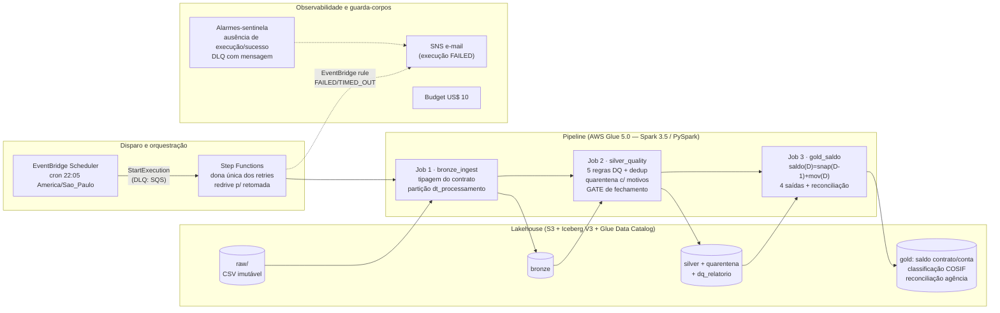

# Arquitetura da Solução

## O problema em uma frase

Todo dia, centenas de milhões de lançamentos contábeis chegam em lote e precisam
virar **saldo consolidado por contrato e por conta antes das 06:00 do dia
seguinte**, com qualidade auditável, porque o consumidor é o fechamento contábil
regulatório. Isso classifica o problema: é um **batch crítico com deadline**, e
todas as decisões deste desenho otimizam o *pior* dia (falha às 3h da manhã), não
o dia em que tudo dá certo.

## Visão geral



**Um dia na vida do pipeline:** às 22:05 (hora de São Paulo), o EventBridge
Scheduler acorda a Step Function, que executa os três jobs Glue em sequência:
tipagem, qualidade, saldo. Cada estágio grava tabelas Iceberg no S3, catalogadas
no Glue Data Catalog. Se qualquer estágio falhar, a execução fica FAILED, um
e-mail sai na hora via SNS, e a retomada é por **redrive**: a Step Function
reexecuta *do estágio que falhou*, sem repetir o que já passou — é a razão de
serem três jobs em vez de um. E se *nada* rodar (agendador quebrado, disparo
perdido), quem acusa são os **alarmes-sentinela**, desenhados para transformar
ausência de sinal em alerta.

**E a trilha local?** Os mesmos três jobs rodam em Docker (Spark 3.5.4 + Java 17
+ Iceberg 1.10.2, as mesmas versões pinadas que vão para o Glue), trocando o
Glue Data Catalog por um catálogo Iceberg em filesystem. `make demo` executa tudo
em um comando, sem nenhuma chamada à AWS (ADR-012). O código dos jobs é idêntico
nas duas trilhas; só a configuração do catálogo muda.

## As camadas: cada uma responde uma pergunta de auditoria

A organização é Medallion, mas o jeito mais útil de entendê-la é pela pergunta
que cada camada responde a um auditor:

| Pergunta | Camada | Tabela | Partição |
|---|---|---|---|
| "O que chegou?" (cópia fiel) | raw | `s3://…/raw/` — arquivo imutável | — |
| "O que recebemos, tipado?" | bronze | `bronze.fin_contabilidade_saldo_contrato` | `dt_processamento` |
| — (referencial) | ref | `ref.cosif_dominio` | — |
| "O que é válido?" | silver | `silver.fin_contabilidade_saldo_contrato` | `dt_processamento` |
| "O que foi rejeitado, e por quê?" | silver | `silver.quarentena` (com `motivos[]`) | `dt_processamento` |
| "Qual a saúde de cada lote?" | silver | `silver.dq_relatorio` | `dt_processamento` |
| "Quanto?" (saídas de negócio) | gold | `saldo_contrato_diario`, `saldo_conta_diario`, `classificacao_cosif`, `reconciliacao_agencia` | `dt_referencia` |

Dois princípios sustentam o desenho:

- **Nada é descartado em silêncio.** O bronze guarda *tudo* que chegou; o que
  viola regra vai para a quarentena *com a lista de motivos*. Isso cria um
  invariante que qualquer auditor confere com duas contagens:
  `bronze = silver + quarentena` (no dataset do desafio: 66.666 = 61.289 + 5.377
  no primeiro dia — exato).
- **Fronteiras limpas de reprocessamento.** Refazer a qualidade de um dia não
  toca o bronze; refazer o saldo não toca a validação. Cada estágio é um job
  separado exatamente para que a retomada de uma falha comece do ponto certo.

### Por que a partição é `dt_processamento`?

Porque ela é a chave do **lote**, e o lote é a unidade de tudo neste caso:
chegada, reprocessamento e idempotência. "Reprocessar o dia D" vira uma única
operação atômica (INSERT OVERWRITE da partição D).

A alternativa natural seria `dt_lancamento`, a data do fato de negócio. O
problema: ela chega **fora de ordem**; o próprio dataset prova, com 3.257
lançamentos cuja data é *posterior* à data de processamento. Particionar por ela
espalharia um lote por várias partições, e reprocessar um lote deixaria de ser
uma operação simples. No Gold, a partição é `dt_referencia` (a data do snapshot
de saldo), pela mesma lógica.

Granularidade: diária. Em produção, isso dá partições de ~60 GB, um tamanho
saudável. Horária fragmentaria em arquivos pequenos demais; mensal esconderia a
unidade de reprocessamento.

## A leitura do SLA: por que "< 1 hora" e "janela de 4 horas" não se contradizem

O enunciado traz um SLA de processamento "< 1 hora" e uma janela de 22h→02h
(4 horas). À primeira vista parece inconsistência; a leitura adotada é que são
**camadas de um requisito de resiliência**:

```
22:00  dado pronto (D+0)
22:05  disparo agendado
23:05  a execução 1 DEVE ter acabado  ← SLA < 1h por execução (dimensiona o cluster)
  ↕    sobra para ~2 retentativas ou um reprocessamento
02:00  fim da janela de processamento ← orçamento de falha
06:00  fechamento contábil            ← 4h de contingência para incidente grave
```

Em outras palavras: a 1 hora dimensiona o **cluster**; a janela dimensiona o
**plano de falha** (retries da Step Function + redrive); as 4 horas finais são a
margem operacional para o pior cenário. Essa leitura aparece no desenho como
timeout de job *menor* que o SLA (falhar rápido em vez de estourar a janela em
silêncio) e como orçamento explícito de retentativas.

## Escala de produção: como 300M de transações/dia cabem em 1 hora

### A decisão central: incremental, nunca full scan

A conta que **não** fecha: recalcular saldo somando o histórico. Com 5 anos de
retenção, seriam ~550 bilhões de linhas varridas por dia. Nenhum cluster
razoável entrega isso em 1 hora, e o custo cresceria sem teto junto com o
histórico.

A conta que fecha (ADR-005):

```
saldo(D) = snapshot(D−1) + movimento(D)
```

O trabalho diário passa a ser proporcional **ao dia**, não ao histórico: agregar
os 300M de lançamentos do dia por contrato, juntar com o snapshot de ontem
(um join), e reescrever uma partição. É a mesma ideia do saldo anterior numa
fatura: ninguém resoma a conta desde a abertura; parte-se do saldo de ontem.

Três contenções de escopo completam o raciocínio:

1. **Poda de partição em toda leitura**: nenhum job lê mais que o dia que
   processa (mais uma partição de snapshot, no Gold);
2. **Anti-join de unicidade limitado à janela de lookback** (7 dias,
   configurável): verificar `id_transacao` contra 5 anos de histórico custaria um
   join de 300M contra 550 bilhões; contra 7 dias, custa 300M contra ~2 bilhões
   (ADR-006);
3. **Broadcast do referencial COSIF**: o domínio tem dezenas de linhas; enviá-lo
   a todos os executors evita embaralhar (shuffle) o lado de 300M por causa de
   um join com uma tabela minúscula.

### Dimensionamento proposto (ponto de partida; o número final se mede)

Volumetria estimada: 300M linhas × ~200 bytes ≈ **60 GB/dia** de entrada, com o
shuffle dominando o custo (janela de dedup e joins do Gold).

| Parâmetro | Valor | Racional |
|---|---|---|
| Worker type | `G.2X` (2 DPU: 8 vCPU, 32 GB) | trabalho pesado de shuffle se beneficia de mais memória por worker — menos spill para disco |
| Workers | 20 (= 40 DPU, 160 vCPU) | 300M linhas ÷ 160 cores ≈ 1,9M linhas/core; a 20–50 mil linhas/s/core, cada estágio de shuffle fecha em 1–2 min de CPU; com 3–4 estágios + I/O S3 → **15–25 min de parede por job crítico**, dentro do SLA de 1h com folga ≥ 2× |
| Auto scaling | habilitado, máx. 20 | o bronze precisa de menos que silver/gold; paga-se pelo usado |
| Timeout | 55 min/job | menor que o SLA de propósito: falha rápida e visível, nunca janela estourada em silêncio |
| Retries | 0 no Glue; SFN com 2 (bronze) e 1 (silver/gold) | ADR-002 — retry em dois níveis multiplica execuções; silver/gold falham por motivos determinísticos (gate, reconciliação), onde repetir não conserta |
| `spark.sql.shuffle.partitions` | ~512 (2–3× cores) | o AQE coalesce reduz quando sobra |

**Custo estimado nessa configuração:** 3 jobs × ~20 min × 40 DPU × US$ 0,44/DPU-h
≈ **US$ 18/dia** (~US$ 530/mês). É deliberadamente um número de *partida* para a
conversa de FinOps: auto scaling e ajuste fino derrubam, e a disciplina praticada
neste projeto (estimar antes, medir depois) vale dobrada nessa escala.

### As três otimizações Spark, e o limite de cada uma

- **Broadcast join** — usado no referencial COSIF (validação e classificação),
  sempre de forma *explícita* (`F.broadcast`). Quando atrapalha: broadcast de
  tabela grande (o snapshot com 300M de contratos jamais: estoura driver e
  executors; ele vai por sort-merge join); broadcast dentro de loop (reenvia a
  tabela por iteração); e o `autoBroadcastJoinThreshold` automático promovendo
  broadcast surpresa numa tabela que cresceu, daí a preferência pelo explícito.
- **Skew (contas concentradas)** — três camadas: o estágio mais pesado (janela de
  dedup) particiona por `id_transacao`, um UUID, uniforme por construção; o
  `spark.sql.adaptive.skewJoin` fica ligado, e o AQE divide partições gordas em
  runtime; e se uma conta-mãe concentrar milhões de lançamentos na agregação por
  conta, o plano B documentado é **salting** (agregação parcial por conta+sal,
  depois final por conta). O salting não é aplicado preventivamente: ele cega o
  AQE e complica o código; entra quando uma métrica de produção mostrar o
  gargalo.
- **Cache/persist** — a regra: cachear o que alimenta **múltiplos consumidores no
  mesmo job**. No silver, o resultado das regras (uma janela + dois joins)
  alimenta três escritas; no gold, o silver do dia alimenta quatro saídas mais o
  controle de consistência. O custo é memória dos executors (com spill para
  disco), que em produção é o que puxa o G.2X, e a disciplina do `unpersist()`.
  Entre jobs, nada de cache: a materialização entre estágios é a própria tabela
  Iceberg, que além de "cache" é contrato e trilha de auditoria.

## Retenção: 5 anos hot + 10 anos cold — com uma armadilha evitada

A retenção é implementada de forma **diferente por zona**, e a diferença importa:

- **`raw/`** (arquivos originais, imutáveis, nunca referenciados por metadado de
  tabela): lifecycle S3 clássico por idade do objeto — Standard → Glacier aos
  5 anos, expiração aos 15 (Terraform, `s3.tf`).
- **`warehouse/`** (tabelas Iceberg): lifecycle por idade **seria um erro**, e é
  uma armadilha comum. Um arquivo Parquet gravado há anos pode continuar
  referenciado pelo metadado *atual* da tabela; transicioná-lo ao Glacier quebra
  qualquer leitura que o toque (`InvalidObjectState`), e expirá-lo **corrompe a
  tabela** (o manifesto aponta para um arquivo que não existe). A retenção aqui é
  do próprio Iceberg, por **partição de negócio**: a manutenção agendada remove
  ou arquiva partições além de 5 anos (`dt_referencia`), e o `expire_snapshots`
  libera de fato os arquivos órfãos.

A manutenção Iceberg (evolução natural de produção) roda fora da janela crítica:
`rewrite_data_files` semanal (compacta os arquivos pequenos do overwrite diário)
e `expire_snapshots` retendo ~30 dias de time travel. Um detalhe de leitura:
ordenar a escrita do snapshot por `id_contrato` melhora compressão e poda para as
consultas mais comuns.

## Observabilidade: cobrir também o cenário em que nada roda

O critério deste bloco: como descobrir um problema às 3h da manhã, inclusive o
problema de nada ter rodado.

1. **Logs estruturados** (`lib/log.py`): uma linha JSON por evento (job, etapa,
   partição, métricas, duração medida por relógio monotônico). No Glue vai ao
   CloudWatch e vira consulta no Logs Insights
   (`filter evento="gate_reprovado"`), sem regex frágil. Nota de campo: durante o
   desenvolvimento, a duração monotônica no log desmentiu o relógio de parede e
   diagnosticou um clock skew de ambiente em minutos.
2. **Métricas de qualidade como dado**: o `silver.dq_relatorio` é tabela; a
   tendência de quarentena por motivo é uma consulta SQL, não scraping de log.
3. **Alarmes por ausência**: "nenhuma execução iniciada em 24h" e
   "nenhum sucesso em 24h", ambos com `treat_missing_data = breaching` — a
   *falta* da métrica também dispara, então até um agendador desligado gera
   alerta. Complementa a DLQ do disparo (com alarme): se o EventBridge não
   conseguir iniciar a Step Function, o evento fica retido e visível, em vez de
   sumir. Limitação: a granularidade é diária; a checagem fina "22:15
   sem execução" em produção seria um schedule com uma verificação trivial.
4. **Falha ativa**: execução FAILED/TIMED_OUT/ABORTED → EventBridge → SNS →
   e-mail, com o histórico completo da execução preservado na Step Function para
   diagnóstico e redrive.
