# Evidências — execução na conta AWS real

Registro da execução do pipeline na AWS (us-east-1, 01/09/2026), complementando a
trilha local. O roteiro que gerou estas capturas é o `docs/runbook_aws.md`; os
arquivos estão em [`docs/evidencias/`](evidencias/). Toda a infraestrutura foi
criada por `terraform apply` (35 recursos), sem passo manual de console.

Custo do exercício: estimado **antes** da execução em ~US$ 0,14 por execução do
pipeline (~US$ 0,42 pelos 3 dias, < US$ 1 no total — fórmula e premissas no
runbook, seção 2); o custo medido no Cost Explorer entra na evidência 10.

## 1. Infraestrutura completa por IaC

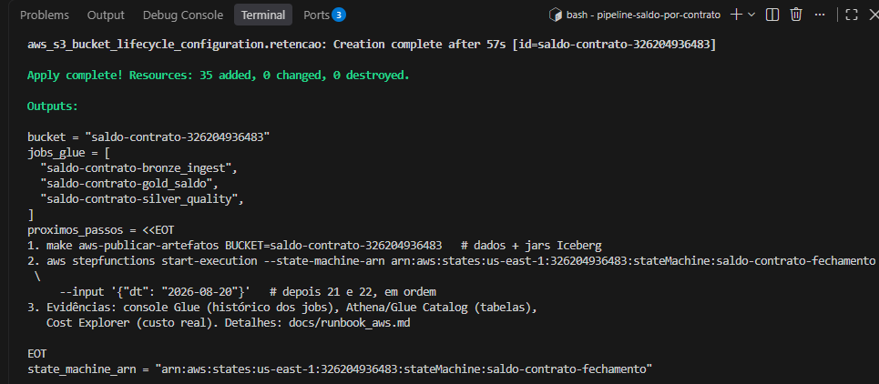

`terraform apply` numa conta recém-criada: **35 added, 0 changed, 0 destroyed**,
com os outputs (bucket, state machine, 3 jobs). Prova o requisito de jobs Glue
provisionados com configuração de workers, timeout e retries — e que o ambiente
inteiro nasce de um comando, reproduzível em qualquer conta.

## 2. Os três jobs Glue no console

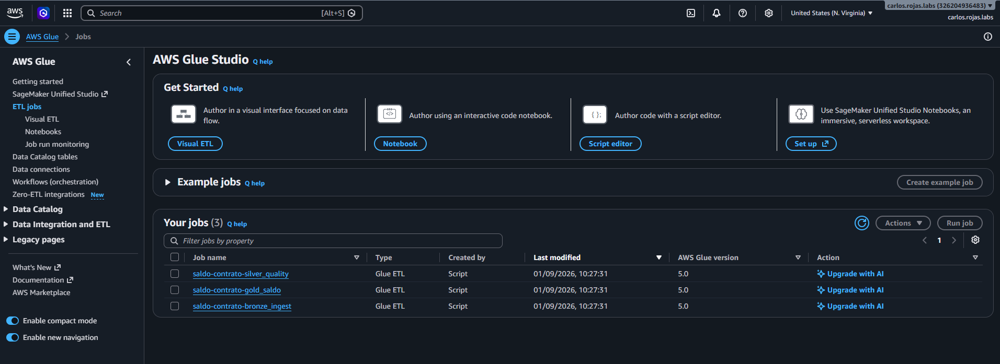

`saldo-contrato-bronze_ingest`, `silver_quality` e `gold_saldo`, Glue 5.0,
criados no mesmo instante pelo mesmo `terraform apply`.

Detalhe da configuração, capturado no bronze — os três jobs compartilham a
mesma configuração, definida uma única vez no Terraform (`glue.tf` e
`variables.tf`, com cada valor justificado em comentário):

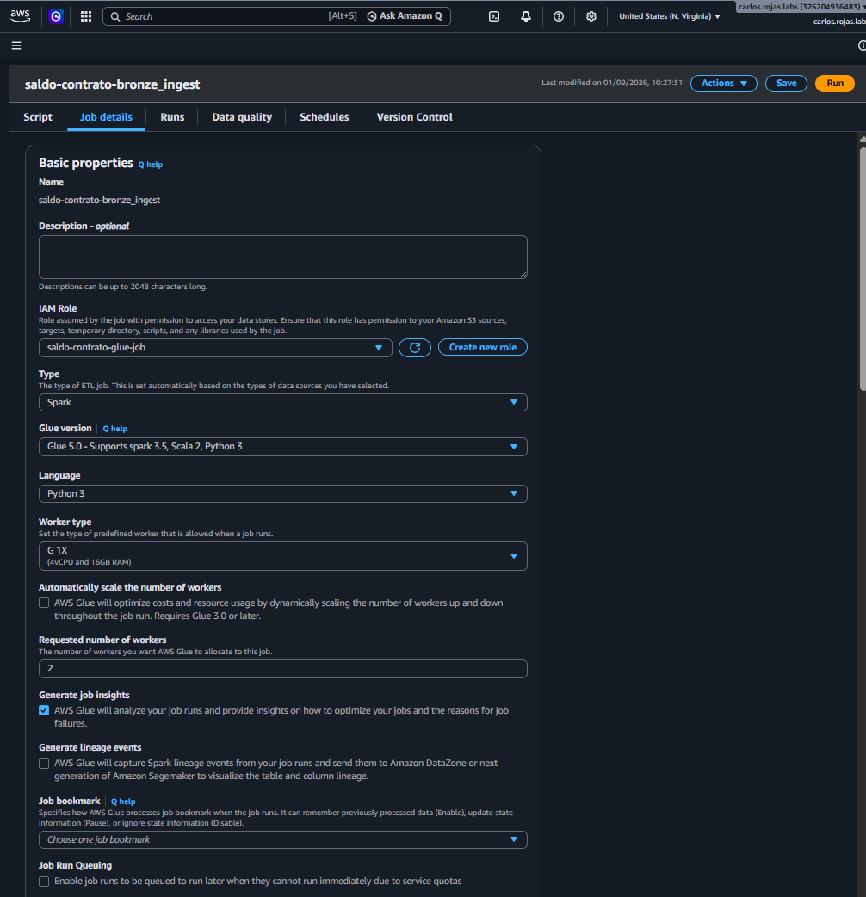

**Worker type G.1X** (4 vCPU / 16 GB) × **2 workers**, Glue 5.0, Python 3 —
o dimensionamento da prova de conceito (o de produção, 20×G.2X para 300M/dia,
está em `docs/arquitetura.md`). Atende "configuração adequada de workers".

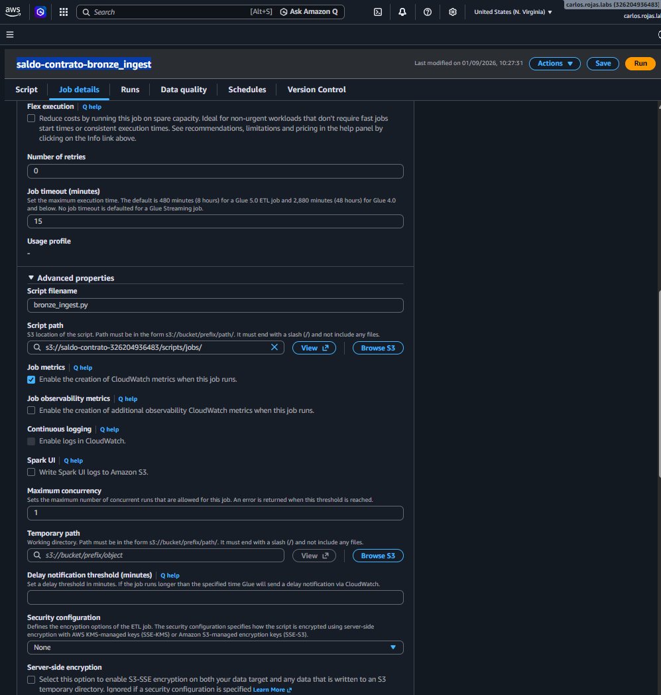

**Number of retries 0**, **timeout 15 min** e **Maximum concurrency 1**: o
retry pertence só à Step Function (ADR-002); o timeout menor que o SLA faz o
job falhar rápido em vez de estourar a janela; a concorrência 1 é o cinto de
segurança da idempotência contra disparo duplo.

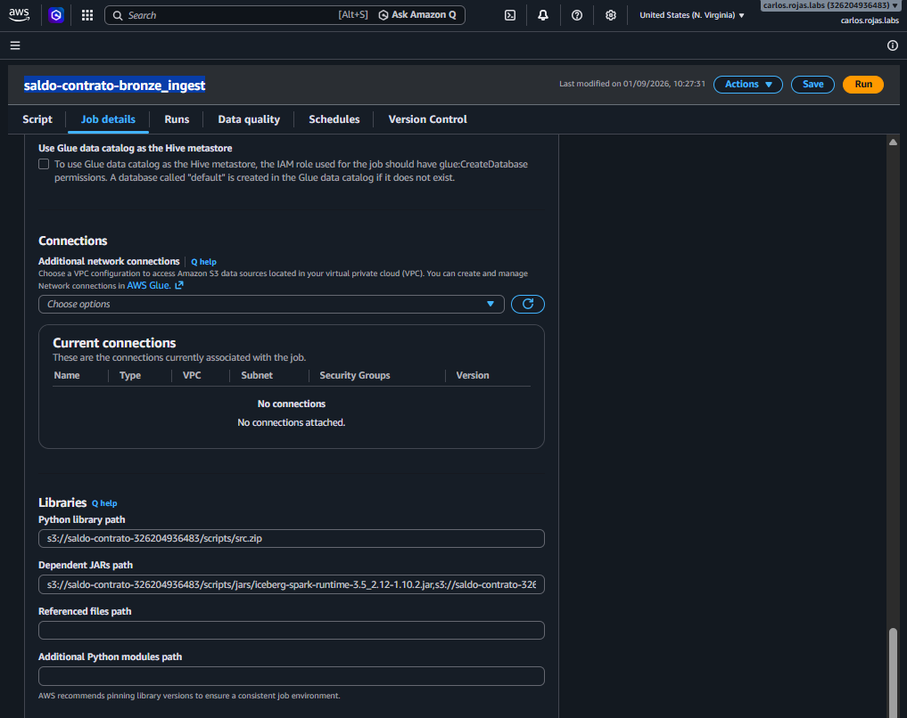

As bibliotecas do job: `src.zip` (o código de `src/lib`) e os **jars
`iceberg-spark-runtime-3.5_2.12-1.10.2` + `iceberg-aws-bundle`** — o Glue 5.0
embarca Iceberg 1.7.x, que não escreve V3; o runtime 1.10.2 entra por
`--extra-jars`, a mesma versão pinada na trilha local (ADR-004).

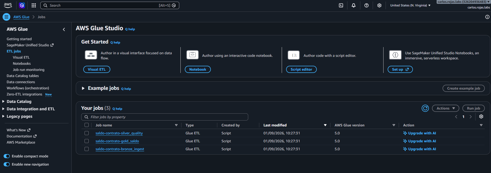

Os parâmetros do job: `--datalake-formats` **vazio** e `--user-jars-first true`
(sem isso o Iceberg nativo do Glue subiria junto e conflitaria com o 1.10.2), e
os `--SALDO_*` que configuram catálogo/warehouse — o mesmo código dos jobs roda
local e na nuvem trocando só estes valores (ADR-012). As tags
`gerenciado=terraform` e `projeto=saldo-contrato` marcam a origem IaC e
habilitam o filtro de custo no Cost Explorer.

## 3. Execução do dia 2026-08-20 — com falha real e retomada por redrive

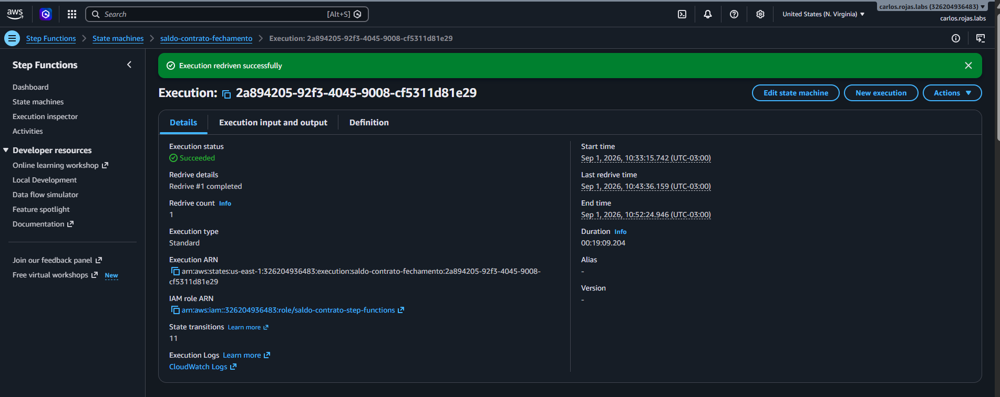

A primeira execução falhou no Bronze com `SystemExit: 0`: os jobs terminavam com
`sys.exit(main())`, encerramento normal num processo Python local, mas o Glue
executa o script dentro do driver e trata qualquer `SystemExit` (mesmo com
código 0) como término anormal. É uma diferença exclusiva da plataforma — o tipo
de coisa que a trilha local não consegue pegar, e exatamente o motivo de a
trilha AWS existir (ADR-012).

A tela mostra o ciclo completo: execução iniciada 10:33, falha, correção de uma
linha no script (republicada via `terraform apply` — o Glue busca o script do S3
a cada run), **Redrive #1 completed** às 10:43 e **Succeeded** às 10:52. O
redrive retomou do estágio que falhou, sem reexecutar o que já tinha passado.
No meio do incidente, o caminho de erro desenhado funcionou por inteiro: retry
da SFN com backoff, um `ConcurrentRunsExceededException` transitório absorvido
(o `MaxConcurrentRuns=1` impedindo runs simultâneos) e e-mail do SNS na falha
(evidência 9).

## 4. Grafo da execução verde

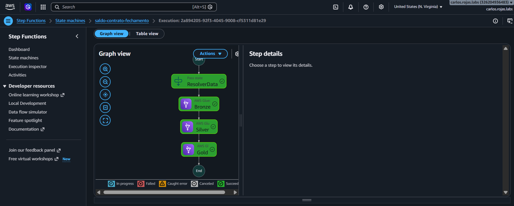

`ResolverData → Bronze → Silver → Gold`, todos verdes. Os três estágios levaram
~9 min no total (G.1X × 2, dataset de 199.998 linhas), dentro da estimativa de
8–12 min do runbook.

## 5. Os três dias executados em ordem

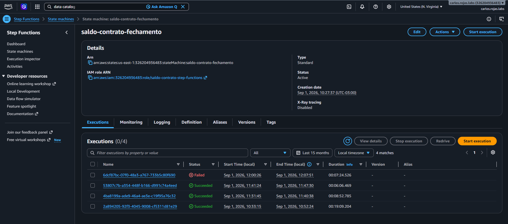

Lista de execuções da state machine: dias 20, 21 e 22 SUCCEEDED, em ordem —
obrigatória porque o saldo é incremental (o Gold do dia D parte do snapshot de
D−1; a guarda de continuidade recusa pular dia publicado sem snapshot).

## 6. Histórico de runs no Glue com DPU-hours

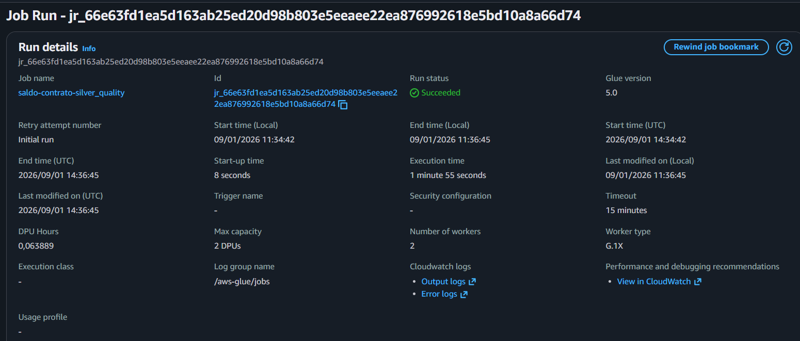

Runs por job com duração e DPU-hours medidos — o insumo real da conta de custo
(workers × DPU × horas × US$ 0,44) e a base da comparação estimado × medido.

## 7. Glue Data Catalog: databases e tabelas Iceberg

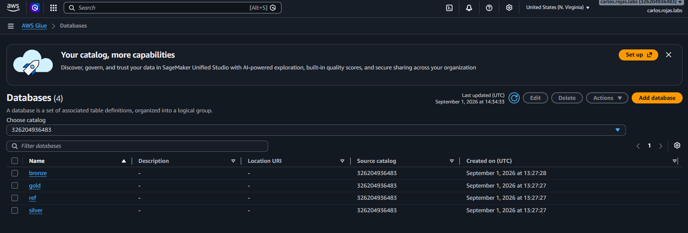

Os 4 databases `bronze`, `silver`, `gold` e `ref`, criados pelo Terraform no
`apply` (mesmo timestamp dos jobs).

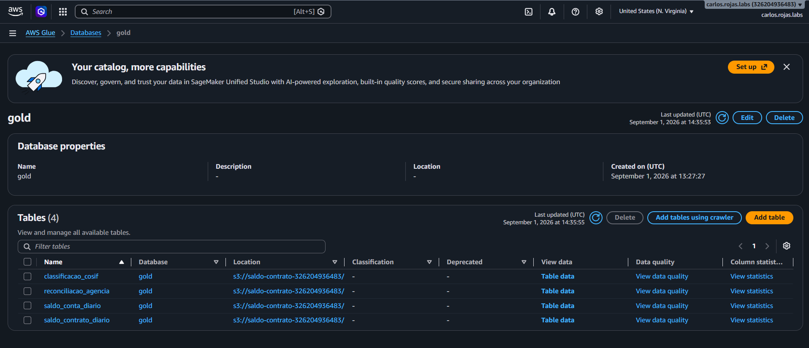

Dentro do `gold`, as 4 tabelas criadas pelos próprios jobs
(`CREATE TABLE IF NOT EXISTS`): a divisão deliberada do ADR-010 — a plataforma
(databases) pertence à infra, o schema (tabelas) pertence ao código. É o mesmo
código que na trilha local cria as tabelas no HadoopCatalog: catálogo por
configuração (ADR-012), atendendo "utilizar Glue Data Catalog para
gerenciamento de metadados".

## 8. Logging estruturado no CloudWatch

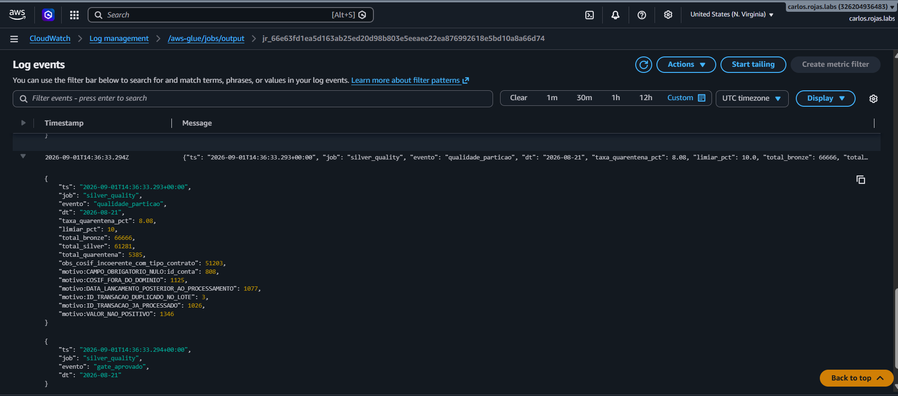

Linha JSON `"evento": "qualidade_particao"` no CloudWatch Logs, com contagens
por motivo, taxa de quarentena e limiar — consultável no Logs Insights sem
regex (`filter evento="gate_reprovado"`). Atende "tratamento de erros e logging
estruturado". As contagens batem com a execução local e com o oráculo
independente: mesma engine, mesmo código, mesmos números.

## 9. Alerta de falha por e-mail (SNS)

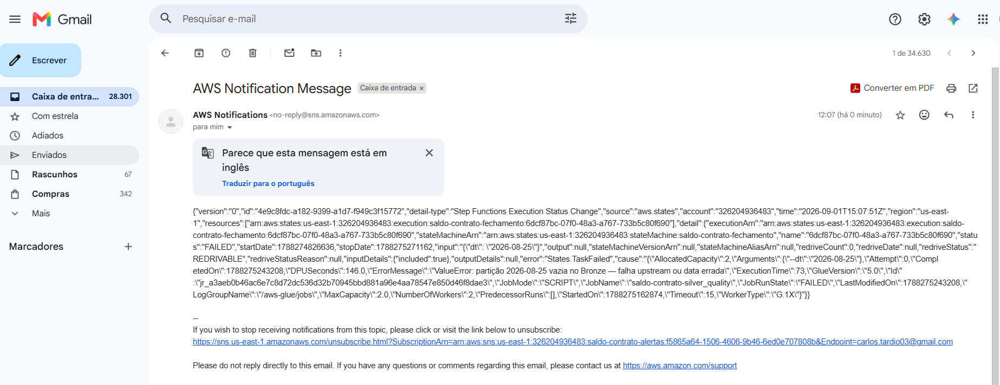

E-mail recebido quando a execução do incidente da evidência 3 falhou:
regra EventBridge (status FAILED/TIMED_OUT/ABORTED) → SNS. Não foi um teste
sintético — foi o caminho de erro operando durante um incidente real.

## 10. Custo medido (Cost Explorer)

Custo real do exercício no Cost Explorer (filtro por serviço Glue + tag
`projeto`), comparado com a estimativa feita antes de executar. Disciplina de
FinOps: estimar antes, medir depois.
